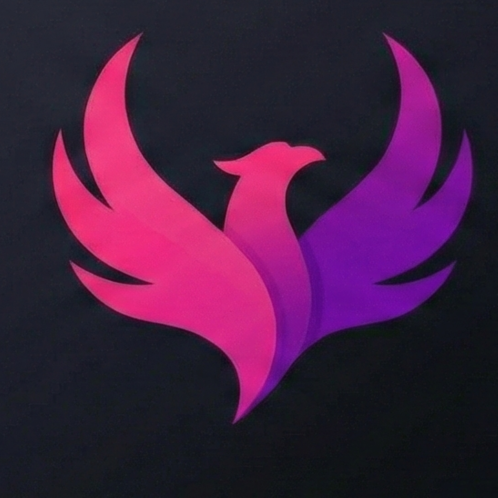

# 🎥 Cenna - Movie & Series Curation

<p align="center">
  
</p>

<p align="center">
  <b>Sua curadoria definitiva de cinema e TV.</b><br>
  <i>Your ultimate movie and TV curation hub.</i>
</p>

<p align="center">
  <a href="#-sobre">Português</a> • 
  <a href="#-about">English</a> • 
  <a href="#-setup">Setup</a>
</p>

---

## 🇧🇷 Sobre o Cenna
O **Cenna** é um app colaborativo para amantes de audiovisual. Chega de perder horas escolhendo o que assistir; aqui a curadoria é feita por pessoas reais através de listas temáticas integradas à API do TMDB.

### ✨ O que ele faz?
* **Listas Colaborativas:** Crie temas e deixe a comunidade injetar novas obras.
* **Smart Detection:** Identifica automaticamente se é filme ou série ao navegar.
* **Interface Premium:** Dark mode nativo com efeitos de Blur e Glassmorphism.
* **Imersão:** Feedback tátil (Haptics) em todas as interações principais.

### 🎥 Demonstração (App Preview)
<p align="center">
  
  
</p>

---

## 🇺🇸 About Cenna
**Cenna** is a collaborative app for cinema lovers. Stop wasting hours deciding what to watch; get real recommendations through thematic lists powered by the TMDB API.

### ✨ Key Features
* **Crowdsourced Lists:** Create themes and let the community inject new titles.
* **Smart Detection:** Automatically distinguishes movies from TV shows.
* **Premium UI:** Native dark mode with Blur and Glassmorphism effects.
* **Immersion:** Haptic feedback on all key interactions.

---

## 🛠 Tech Stack
| Component | Tech |
| :--- | :--- |
| **Framework** | Expo SDK 54 (React Native 0.81) |
| **Engine** | React 19 (New Architecture) |
| **Styling** | NativeWind (Tailwind CSS) |
| **Backend** | Supabase & Firebase |
| **Data** | TMDB API |

---

## 🚀 Setup
```bash
# Clone o repositório
git clone [https://github.com/joaozzin-dev/bros.git](https://github.com/joaozzin-dev/bros.git)

# Instale as dependências (Obrigatório para React 19)
npm install --legacy-peer-deps

# Inicie o desenvolvimento
npx expo start