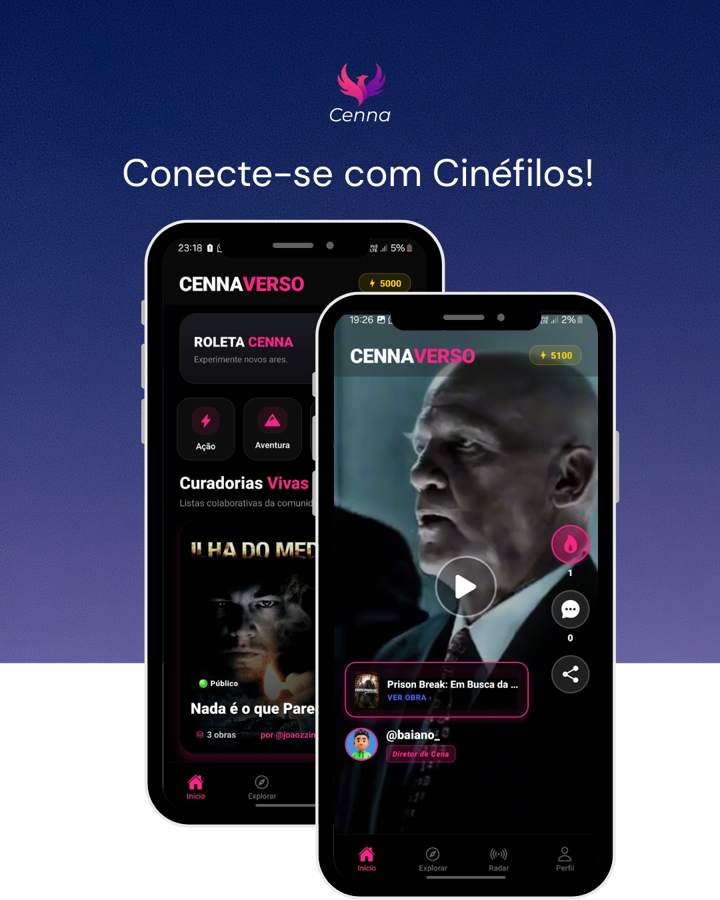
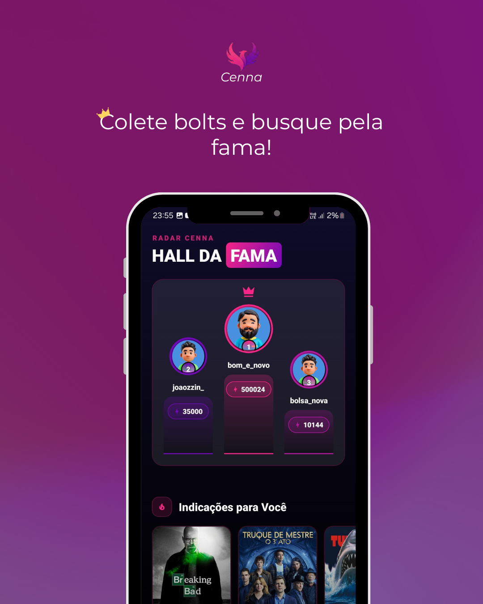

# CennaVerso

### A rede social de cinema que você estava esperando 🎬

**Curadorias colaborativas • Vídeos • Enquetes • Feed infinito**

 

[-FF0080?style=for-the-badge&labelColor=000000)](https://github.com/Joaozzin-dev/cenna-app/releases/download/v1.0.0/CennaVerso-v1.0.0.apk)

---

## 📱 Capturas de Tela

  
  
  

---

## 🌟 Recursos Principais

### 📺 Feed Social em Tela Cheia
Scroll vertical com vídeos (tap to play), posts de texto e enquetes em tempo real. Double tap para curtir.

### 🎬 Curadorias Colaborativas
Crie e participe de listas temáticas. Descubra obras através da **Roleta Cenna** com filmes em alta.

### 🔥 Sistema de Bolts
Ganhe pontos ao interagir e criar conteúdo. Desbloqueie badges e recursos premium.

### 💬 Comentários e Reações
Interaja com a comunidade em tempo real sobre suas obras favoritas.

### 🔍 Busca Integrada TMDB
Acesse informações completas de milhares de filmes e séries.

---

## 🚀 Instalação

1. Clique no botão **BAIXAR AGORA** acima
2. Ative "Instalar apps desconhecidos" nas configurações do Android
3. Abra o arquivo APK baixado e instale
4. Pronto! 🎉

---

## 🔧 Tecnologias

**Otimizado para performance:**
- ⚡ Nova Arquitetura React Native (Fabric + TurboModules)
- 🎯 60fps garantidos
- 🎨 Glassmorphism + Haptics

---

## 📜 Requisitos

- **Android:** 6.0 ou superior
- **Armazenamento:** 90 MB livres
- **Internet:** Conexão estável recomendada

---

## 🆘 Suporte

- 📧 **Email:** appcenna@gmail.com
- 🐛 **Issues:** [Reporte bugs aqui](https://github.com/Joaozzin-dev/cenna-app/issues)

---

## 📄 Licença

Distribuído sob a licença MIT. Veja [LICENSE](LICENSE) para mais informações.

---

### Desenvolvido com ❤️ para os amantes de cinema

 

**João Pedro**  
*Full Stack Developer*

 

**⭐ Gostou? Deixe uma estrela no repositório!**

 

Copyright © 2025 CennaVerso. Todos os direitos reservados.

